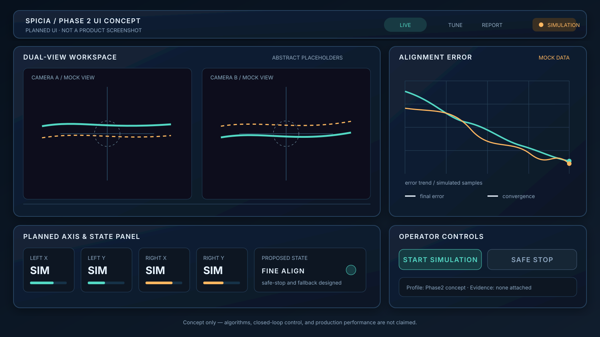

# Splicia Vision Platform

> **Status: Phase2 design in progress.** This repository does not claim completed vision algorithms, motion control, closed-loop performance, or a production UI.

Splicia is a sanitized engineering case study for an industrial microscopic-vision platform. It records completed Linux camera/platform bring-up work and presents the proposed Phase2 software architecture and UI direction without exposing customer, legacy-product, or private implementation material.

## Current evidence boundary

| Status | Scope |
| --- | --- |
| Completed / observed | Embedded Linux platform bring-up; IMX296 camera discovery; media topology and RAW-output diagnostics; driver/ISP/application fault-boundary investigation; platform-migration investigation |
| Designed for Phase2 | Modular capture, vision, estimation, motion, control, UI, logging, and replay boundaries; operator/engineering UI concept; verification contract |
| Planned, not yet implemented or validated | Fiber geometry extraction; calibrated dual-view fusion; semantic multi-axis motion; closed-loop alignment; deterministic replay packages; quantitative performance results |

## Phase2 UI concept



*Original framework drawing for the planned Phase2 interface. It is not a product screenshot; all charts and values are mock data.*

## Proposed system direction

```text
dual microscopic cameras
          │
          ▼
Linux capture pipeline
          │ frames + timestamps
          ▼
vision measurement ──> alignment-state estimation
                              │
                              ▼
                      closed-loop controller
                              │
                              ▼
                       multi-axis motion
                              │
                 ┌────────────┴────────────┐
                 ▼                         ▼
          operator UI              telemetry / replay
```

This diagram is an architecture target, not an implementation-status claim. Detailed proposed responsibilities and the planned verification contract are documented in [`docs/architecture.md`](docs/architecture.md) and [`docs/validation.md`](docs/validation.md).

## What is not claimed

This case study does not claim a completed commercial fiber splicer, finished vision algorithms, validated multi-axis control, production loss performance, a certified high-voltage arc subsystem, a released customer product, or measured closed-loop results.

## Disclosure boundary

The private engineering repository contains platform experiments and implementation records that are not suitable for direct publication. This public case study excludes customer/legacy product material, network addresses, credentials, private binaries, captured production images, commercial parameters, source packages, and site-specific logs. See [`docs/disclosure-boundary.md`](docs/disclosure-boundary.md).

No reuse license is currently granted for original Splicia documents. The repository is published for portfolio review and technical discussion.
